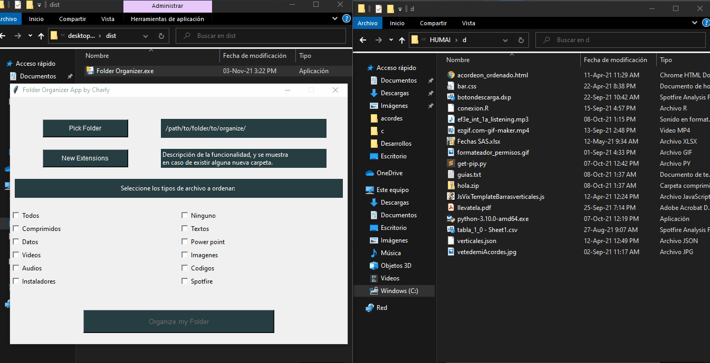
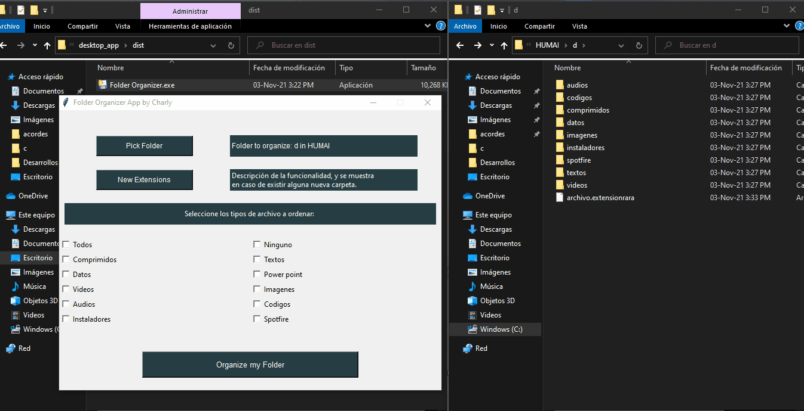

# Python Folder Organizer 📂
---

## Sobre el objetivo de la aplicación:
Esta aplicación automatiza la tarea de ordenar una carpeta en base al tipo de formato de los distintos archivos que se podrian encontrar en la misma. Fue desarrollada con python usando la libreria **os** y **tkinter** para realizar la interfaz.

|Tipo de archivo|Extensiones incluidas|
|---------------|:---------------------:|
|todos|todas|
|textos|pdf, docx, doc, txt|
|comprimidos|zip, 7z, rar|
|datos|csv, xlsx, xlsm, xlsb, xls, json|
|Power Point|pptx, ppt|
|videos|mp4, avi, mkv, mov, flv, wmv|
|imagenes|png, jpg, bmp, tif, gif|
|audio|mp3, aiff, au, flac, wma, opus|
|codigos|py, ipynb, r, rscript, html, css, svg, js, xml|
|instaladores| msi, exe|
|spotfire file|dxp|
|ninguno|ninguna **(podria usarse para agregar una nueva extensión)**|

  
Ejemplo de uso

  
  
  
  

  
Ejemplo de uso (agregando un formato desconocido por la aplicación)

  
  
  
  

---
### Hecho con:
 ✔️ Python
  
 ✔️ Interfaz realizada con Tkinter
 
